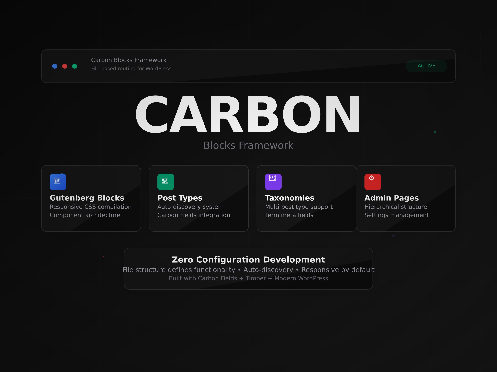

# Carbon Blocks Framework



**Zero-Configuration WordPress Development Framework**  
*File structure defines functionality • Auto-discovery • Responsive by default*

Carbon Blocks is a modern WordPress development framework that combines Carbon Fields, Timber (Twig), and Gutenberg with file-based auto-discovery. Built for developers who want to focus on building features rather than configuration.

## 🎯 Key Goals

- **Zero Configuration**: File structure automatically defines functionality
- **Developer Experience**: Modern tools with intuitive patterns
- **Responsive First**: Built-in breakpoint system with auto-compilation
- **Component Architecture**: Reusable blocks with isolated styles and scripts
- **Type Safety**: Carbon Fields integration for structured content
- **Performance**: On-demand compilation and optimized asset loading

## 🚀 Core Features

### 📦 Gutenberg Blocks
**Responsive CSS compilation • Component architecture • Auto-discovery**

```
src/blocks/
└── Heroes/                    # Auto-creates "carbon-blocks-heroes" category
    └── hero-section/          # Block component
        ├── block.php          # Uses reusable template - auto-detects name/category
        ├── block.twig         # Timber template with context
        ├── components/        # Reusable Twig components
        │   └── button.twig
        ├── scripts/           # Auto-compiled and concatenated JavaScript
        │   └── example.js
        └── styles/            # Responsive CSS files
            ├── XS.css         # Mobile first
            ├── SM.css         # Small tablets
            ├── MD.css         # Tablets
            ├── LG.css         # Desktop (base styles)
            ├── XL.css         # Large screens
            └── 2XL.css        # Extra large screens
```

### 🗂️ Post Types
**Auto-discovery system • Carbon Fields integration • Settings management**

```
src/post-types/
└── villas/
    ├── config.php           # Auto-registers post type via $post_type_slug global
    └── field-groups/        # Carbon Fields meta boxes (auto-assigned)
        ├── villa-details.php
        └── villa-media.php
```

### 🏷️ Taxonomies
**Multi-post type support • Term meta fields • Auto-discovery**

```
src/taxonomy/
└── villas, post/            # COMMA-SEPARATED post type names
    └── amenities/
        ├── config.php       # Auto-registers taxonomy via globals
        └── field-groups/    # Term meta fields
            └── details.php
```

### ⚙️ Admin Pages
**Hierarchical structure • Settings management • Auto-discovery**

```
src/admin-pages/
└── theme-settings/
    ├── page.php             # Main admin page
    └── advanced/            # Nested sub-pages supported
        └── page.php
```

## 🎨 Responsive CSS System

### Breakpoint Configuration
Built on Bootstrap-inspired breakpoints with intelligent compilation:

```php
// src/config/breakpoints.php
$breakpoints = [
    'XS'  => '@media (max-width: 575.98px)',
    'SM'  => '@media (min-width: 576px)',
    'MD'  => '@media (min-width: 768px)',
    'LG'  => '',  // Base styles - no media query wrapper
    'XL'  => '@media (min-width: 1200px)',
    '2XL' => '@media (min-width: 1400px)'
];
```

### Compilation Process
1. **On-demand compilation** via `carbon_blocks_compile_styles()`
2. **LG.css** serves as base styles (no media query wrapper)
3. **Other breakpoints** automatically wrapped with appropriate media queries
4. **Final CSS** injected inline with blocks for optimal performance

### BEM Naming Convention
```css
.carbon-block--hero-section__title { }
.carbon-block--hero-section__button { }
.carbon-block--hero-section__button--primary { }
```

## 🔧 Development Workflow

### 1. Adding a New Block
```bash
# Create directory structure
mkdir -p src/blocks/Heroes/hero-section/{styles,scripts,components}

# Create required files
touch src/blocks/Heroes/hero-section/block.php
touch src/blocks/Heroes/hero-section/block.twig
touch src/blocks/Heroes/hero-section/styles/LG.css
```

### 2. Block Template (Reusable)
All blocks use the same standardized `block.php`:

```php
<?php
$component = basename(dirname(__FILE__));
$category = basename(dirname(dirname(__FILE__)));

Block::make(__(ucwords(str_replace('-', ' ', $component))))
    ->set_category('carbon-blocks-' . $category)
    ->set_render_callback(function ($fields, $attributes, $inner_blocks) use ($component, $category) {
        carbon_blocks_render_gutenberg($category . '/' . $component, $fields, $attributes, $inner_blocks);
    });
```

### 3. Adding Responsive Styles
```bash
# Create breakpoint-specific styles
echo ".hero-section { padding: 2rem; }" > src/blocks/Heroes/hero-section/styles/LG.css
echo ".hero-section { padding: 1rem; }" > src/blocks/Heroes/hero-section/styles/SM.css
```

### 4. Adding Custom Post Types
```php
// src/post-types/villas/config.php
carbon_create_post_type($post_type_slug, [
    'labels' => [
        'name' => 'Villas',
        'singular_name' => 'Villa'
    ],
    'supports' => ['title', 'editor', 'thumbnail'],
    'has_archive' => true,
    'menu_icon' => 'dashicons-building'
]);
```

## 🛠️ Helper Functions

### Block Context Creation
```php
$context = carbon_blocks_create_context('Heroes/hero-section', $fields, [
    'custom_data' => 'value'
]);
```

### Post Type Registration
```php
carbon_create_post_type($slug, $config);
carbon_create_post_meta_with_tabs($post_type, $title, $tabs);
```

### Taxonomy Registration
```php
carbon_create_taxonomy($slug, $post_types, $config);
carbon_create_taxonomy_meta($taxonomy, $title, $fields);
```

## 🔄 Auto-Discovery System

The framework automatically discovers and registers components based on directory structure:

1. **Post Types & Taxonomies** registered on `init` hook
2. **Blocks, Admin Pages, Field Groups** registered on `carbon_fields_register_fields` hook
3. **Block Categories** auto-created from directory names
4. **Timber Paths** configured for component isolation

## 📁 File Structure

```
carbon-blocksy/
├── src/
│   ├── blocks/              # Gutenberg blocks with responsive compilation
│   ├── post-types/          # Custom post types with Carbon Fields
│   ├── taxonomy/            # Custom taxonomies with term meta
│   ├── admin-pages/         # Settings pages with hierarchical structure
│   └── config/              # Framework configuration
│       ├── setup.php        # Core initialization
│       ├── breakpoints.php  # Responsive breakpoints
│       ├── compile_helpers.php # CSS/JS compilation
│       └── timber/          # Template paths
├── functions.php            # Theme entry point
├── style.css               # Theme metadata
├── screenshot.jpg          # Theme screenshot
└── vendor/                 # Composer dependencies
```

## 🚀 Getting Started

### Requirements
- WordPress 5.0+
- PHP 7.4+
- Composer

### Installation

1. **Clone or download** the theme to your WordPress themes directory
2. **Install dependencies**:
   ```bash
   composer install
   ```
3. **Activate the theme** in WordPress admin
4. **Start building** - create your first block in `src/blocks/`

### Child Theme Support
The framework automatically detects child themes and supports both:
- `get_template_directory()` - Parent theme files
- `get_stylesheet_directory()` - Child theme files (prioritized)

## 🎯 Use Cases

- **Agency Development**: Rapid prototyping with consistent patterns
- **Custom Themes**: Component-based architecture with modern tooling  
- **Block Libraries**: Reusable block collections with responsive design
- **Client Projects**: Zero-config setup with powerful customization options

## 🤝 Contributing

Built with modern WordPress development practices:
- **Carbon Fields** for structured content
- **Timber/Twig** for clean templating
- **File-based routing** for intuitive organization
- **Responsive-first** development approach

---

**Carbon Blocks Framework** - *Making WordPress development feel modern again.*